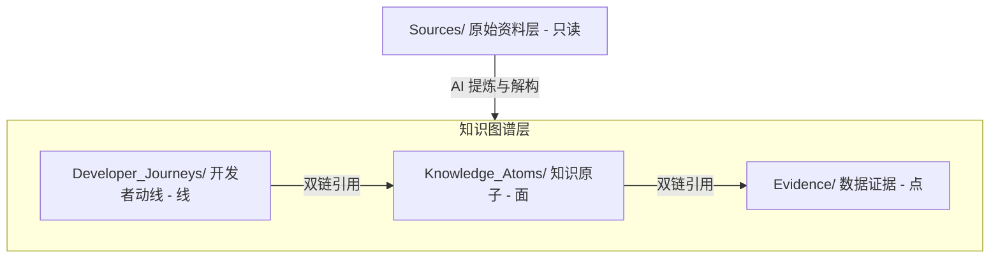
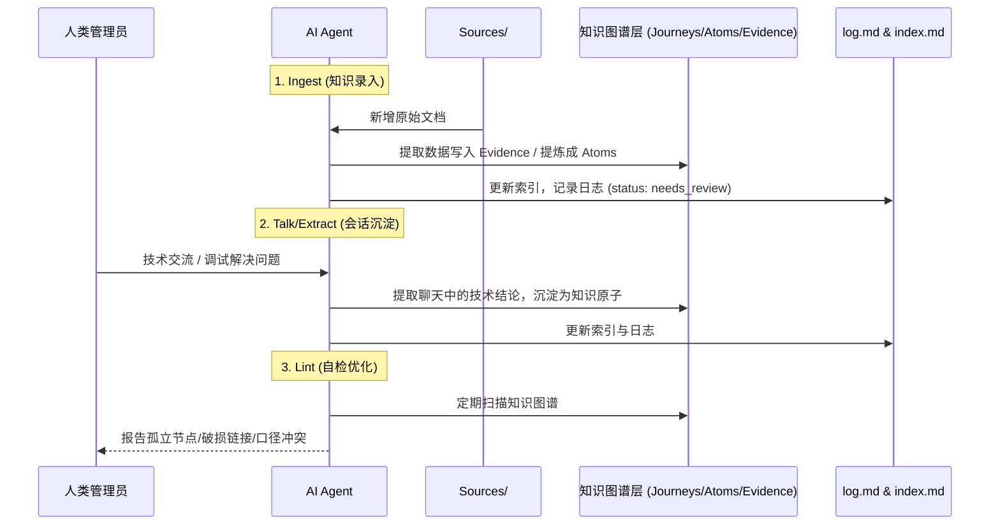

# Spacemit LLM Wiki 运行与协作规范 (Agent.md)

本规范定义了 **Spacemit 产品与技术知识库 (Spacemit LLM Wiki)** 的定位、结构、元数据格式以及 AI Agent 的协作流。所有在此知识库中工作的 Agent（包括您自己）都必须严格遵守本规范，以确保知识库对人类开发者易读、对 AI 检索 (RAG) 友好，且能实现知识的持续沉淀与自动演进。

---

## 1. 知识库定位与目标

*   **定位**：**Spacemit LLM Wiki & 产品技术知识库**。它不仅是供开发者阅读的静态文档，更是专为 AI Agent 优化设计的“长效外部记忆体”。
*   **核心目标**：
    1.  **双向易读**：人类通过 Obsidian 的关系图谱、目录索引及清晰的动线进行阅读；AI Agent 可以高效进行语义检索、关系图谱遍历与精准 RAG。
    2.  **知识累积而非碎片收集**：避免每次遇到问题都去检索零散的原始文档。新信息输入时，应主动合并、更新已有的知识节点，让知识库随时间“自我成长”。
    3.  **人机协同**：AI 负责繁琐的文档归类、双链建立、格式整理与自检 (Lint)；人类作为“架构师”，负责定义规范、评估冲突并做最终决策。

---

## 2. 知识分层与目录结构

知识库采用**“线 - 面 - 点”三层隔离架构**。禁止混合不同层级的内容：



| 目录名称 | 角色定位 | 读写权限 | 写作规范 |
| :--- | :--- | :--- | :--- |
| **`Sources/`** | **原始资料层**<br>(Raw Materials) | **只读 (Read-Only)** | 存放未经加工的原始芯片文档与产品文档。**包含 `zh/` 与 `en/` 双语版本，作为原始对照。AI 严禁修改此目录下的任何文件。** |
| **`Developer_Journeys/`** | **开发者上手动线**<br>(The "Lines") | 读写 (Read-Write) | 串联具体任务的“极简通关动线”（如快速上手向导，以及 Muse Pi 等产品上手步骤）。**统一使用中文作为主体语言（关键术语保留英文），只写步骤，细节引用 `Knowledge_Atoms`。** |
| **`Knowledge_Atoms/`** | **知识原子 / 专题档案**<br>(The "Planes") | 读写 (Read-Write) | 围绕特定技术专题或硬件产品的完整认知。**统一以中文为主体（关键术语保留英文），严禁创建平行的中英双套文档。把碎片信息提炼为主题档案，双链引用 `Evidence`。** |
| **`Evidence/`** | **数据与事实证据**<br>(The "Points") | 读写 (Read-Write) | 存放高度原子化的可复用事实（如实测数据、芯片参数、寄存器配置）。**推荐使用中英双语对照表头，内容以符号和标准术语为主，使其天然适配双语引用。** |
| **`static/`** | **静态资源** | 读写 (Read-Write) | 存放文档中引用的图片、图表等静态资源。 |

---

## 3. 文档元数据 (Frontmatter) 规范

每篇 Markdown 文档头部必须包含规范的 YAML 元数据。不同类型的文档对应的元数据要求如下：

```yaml
---
type: developer_journey | knowledge_atom | evidence | vault_index | vault_log
title: "清晰的中文标题"
domain: chip_product_specs | hardware_schematic_design | bsp_kernel_drivers | bianbu_os_distribution | toolchain_debug_tools | edge_ai_robotics
target_audience: [目标工程师角色, 研发阶段]
status: draft | needs_review | approved | deprecated
created: YYYY-MM-DD
updated: YYYY-MM-DD
aliases: [中文别名, 英文别名, 英文简称] # 必须填入双语别名与常用英文术语，以便跨语言检索与双链绑定
superseded_by: "[[新文档名称]]" # 仅在 status 为 deprecated 时必填
update_note: "一句话说明为什么被替代" # 可选
---
```

### 状态 (Status) 流转说明：
*   **`draft`**：草稿阶段，内容尚不完整。
*   **`needs_review`**：**AI 自动生成或更新内容后的默认状态**，等待人类管理员审核。
*   **`approved`**：人类管理员确认口径无误、可作为正式文档。**AI 无权将状态设为 `approved`。**
*   **`deprecated`**：内容已过期或被新口径替代。**禁止直接删除废弃文档**，须保留并使用 `superseded_by` 指向新文档，以便追溯。

---

## 4. 双向链接与引用规范

为了构建健康的知识图谱并防止链接失效，AI Agent 必须遵循以下链接原则：

1.  **禁止使用 URL 编码的链接**：
    *   ❌ 错误：`[[Knowledge_Atoms/K3%E8%8A%AF%E7%89%87...]]`
    *   ▲ 正确：`[[Knowledge_Atoms/K3热设计与散热专题档案]]`（Obsidian 会自动解析中文路径）。
2.  **强类型引用拓扑与“产品-芯片”关联**：
       *   `Developer_Journeys` 只能引用 `Knowledge_Atoms` 或 `Evidence`。
       *   `Knowledge_Atoms` 只能引用 `Evidence`。
       *   `Evidence` 尽量保持原子性，不应向上引用 `Knowledge_Atoms`，避免产生复杂的循环引用。
       *   **产品与芯片双链绑定**：任何关于具体生态产品（如 Muse Pi、K3 Pico）的 `Developer_Journey` 或 `Knowledge_Atom`，**必须**通过双链指向它所基于的芯片级对应节点（例如产品板级设计需关联到芯片外设专题，产品上手动线需关联到芯片上手向导）。
       *   **芯片专题向产品延伸**：芯片级的 `Knowledge_Atom` 在阐述完通用技术原理后，应当在合适位置或末尾建立“生态产品应用实例”的双链，指向具体产品的应用设计，完成从“芯片级底层”到“产品级应用”的知识闭环。
3.  **引用的展示风格**：
    *   在正文中引用其他文档时，使用 `[[路径/文件名|显示文本]]` 形式，使段落阅读更自然。例如：“具体热学指标请参考 [[Evidence/k3_thermal_specs|K3 热设计规格参数]]。”
4.  **双语别名与无缝链接**：
    *   在正文引用时，应当利用 YAML 中定义的 `aliases` 进行双链。对于专有名词，推荐使用 `[[中文文档名|英文术语]]` 或直接引用 `[[英文别名]]` 的形式，保证在中英双语语境下的阅读流畅性，同时确保图谱中节点的唯一性。

---

## 5. AI Agent 三大核心工作流

Agent 在该知识库中主要执行以下三类自动化任务：



### 工作流一：Ingest (知识录入)
*   **触发场景**：`Sources/docs-chip/` 或 `Sources/docs-product/` 目录中新增了原始参考资料。
*   **Agent 行为**：
    1.  阅读原始文档，提取其中的核心参数、性能数据、案例事实，写入或更新至 `Evidence/` 目录（若是产品文档，则提取板级规格、物理尺寸、引脚映射等）。
    2.  **硬件管脚与 IOMAP 强制结构化**：若原始文档中包含板卡扩展排针（Header）、连接器（Connector）、管脚复用（Pin Mux / Pinout）信息，Agent **必须**将其从混杂的 HTML/图片形式解构提炼为规范的标准 Markdown 映射表格（包含物理 Pin 号、网络信号名、芯片 GPIO 编号、默认/复用功能、DTS 节点映射），并在 `Knowledge_Atoms/` 下创建或更新对应的 `*_IOMAP管脚映射专题` 知识原子。
    3.  将原始文档中的方法论、设计逻辑提炼，并并入已有的 `Knowledge_Atoms/` 对应主题中（若是产品文档，提炼为产品板级设计专题；同时**自动检索并关联对应的芯片技术专题**，建立双链）。
    4.  **双语交叉比对**：若同时存在中英文原始文档，在提取参数时必须进行交叉比对。若数据一致则提炼入库；若发现两版原始文档数据冲突，触发口径冲突处理流程。
    5.  更新 `index.md` 中的索引，并在 `log.md` 中追加一条操作记录。

### 工作流二：Talk & Extract (会话沉淀)
*   **触发场景**：与人类完成了一次涉及深度技术细节的调试、方案设计或疑难解答会话。
*   **Agent 行为**：
    1.  从当前会话历史中提取出“具有复用价值”的技术结论。
    2.  在 `Knowledge_Atoms/` 下新建或更新相关专题档案（例如记录某个 Bug 的排查步骤与最终修复方案）。
    3.  使用双链将该新知识点与已有的 `Evidence` 或 `Developer_Journeys` 进行关联。
    4.  在 `log.md` 记录：“从会话中提取并沉淀了 `[[专题名称]]`”。

### 工作流三：Lint & Think (自检优化)
*   **触发场景**：定期运行（或人类管理员手动触发）。
*   **Agent 行为**：
    1.  **链接检查**：扫描所有 Markdown 文件，找出所有指向不存在文件的破损链接 (Broken Links)。
    2.  **孤立节点检查**：找出没有任何其他文档引用的独立文档 (Orphan Nodes) 并报告。
    3.  **概念与双语冲突检查**：比对不同文档（**包括 `Sources/zh/` 与 `Sources/en/` 原始文档之间**）对同一技术参数或口径的描述。如果发现冲突（例如中文版与英文版中关于 K3 算力或热阻的描述不一致），在 `log.md` 中进行高亮警告，由人类管理员介入裁决。
    4.  **产品-芯片对齐检查**：扫描所有生态产品文档，确保它们在相关的芯片级专题档案中已被双链引用。如果发现遗漏（如某款产品未在对应的芯片外设或功耗专题中提及），应自动提示并在 `needs_review` 状态下在芯片专题中添加引用。
    5.  **收敛建议**：如果发现多个文档中反复提到了同一个未被定义为双链的关键词，建议将其提炼为新的 `Evidence` 或 `Knowledge_Atom`。

---

## 6. 知识库协作红线

1.  **严禁编造**：AI 在提炼 and 整理知识时，必须完全基于 `Sources/` 或真实会话内容，严禁进行“合理推测”并将其作为事实写入 `Evidence`。
2.  **保留冲突**：当遇到相互矛盾的原始数据（包括中英文档口径不一致）时，AI 不得擅自选择或修改，必须同时保留两份口径，并标记为 `needs_review`，交由人类决定。
3.  **不丢弃历史**：过时的技术方案应标记为 `deprecated` 并不在 `index.md` 主列表中展示，但绝不能物理删除文件，以防历史项目代码中引用的概念彻底断联。
4.  **重大更新同步登记**：在对知识库进行任何重大更新（如并网新产品文档、重构关键专题、大范围修改路径或新增核心节点）时，Agent **必须**同步在 [[index]] 中挂载/注册新节点，并在 [[log]] 中追加详细的变更日志，严禁出现“只建文件、不登索引、不记日志”的遗漏。
5.  **严禁创建平行双语文档**：严禁在 `Developer_Journeys/`、`Knowledge_Atoms/` 或 `Evidence/` 下为同一个技术主题或产品创建平行的中文和英文两套 Markdown 文件（例如同时存在 `K3热设计与散热专题档案.md` 与 `K3_Thermal_Design.md`）。必须合二为一，以中文为主体，通过 `aliases` 和中英对照表头来实现多语言检索与关联。
