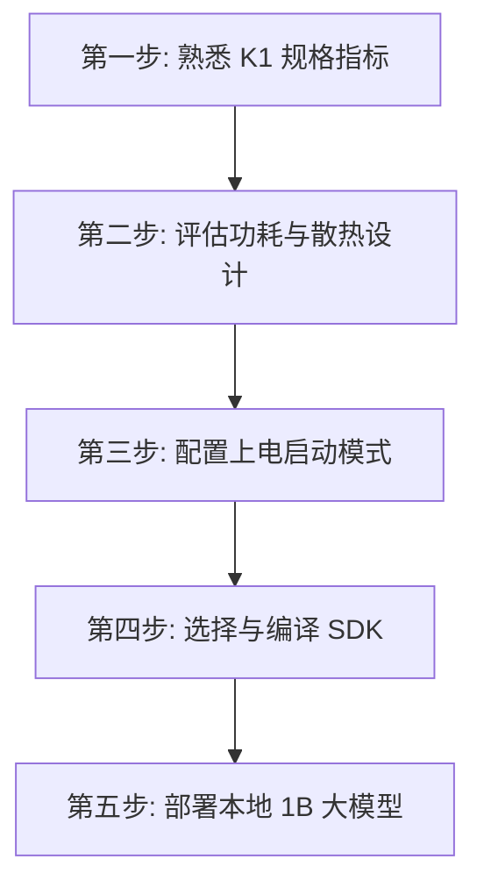

# K1 芯片开发快速上手向导

本向导为开发者提供一条从零开始熟悉 K1 芯片、进行单板硬件电源/功耗评估、配置上电启动模式、选择合适的系统 SDK、到最终在板端跑通本地 1B 大模型的**极简任务动线**。

---

## 🏁 开发者通关动线

### 1. 第一步：熟悉 K1 规格指标
*   **目标**：快速了解 K1 芯片的计算架构与基本接口能力。
*   **行动**：阅读 [K1 产品简介（原始文件）](../Sources/docs-chip/zh/key_stone/k1/k1_docs/root_overview.md)，重点关注通用计算性能与 X60 双簇核心（Cluster 0 集成 AI 算力，Cluster 1 为通用计算）。

### 2. 第二步：评估功耗与散热设计
*   **目标**：根据 K1 的超低功耗指标进行系统供电与被动散热方案设计。
*   **行动**：
    *   阅读 **[[Knowledge_Atoms/K1热设计与功耗专题档案]]**。
    *   K1 的 TDP 仅为 **3W ~ 5W**（参见 [[Evidence/k1_thermal_specs]]）。在一般智能硬件场景下，评估仅需极简的鳍片被动散热或金属外壳导热。

### 3. 第三步：配置上电启动模式
*   **目标**：设计开发板的 Strap Pins 阻值，确保芯片能正确从目标介质（eMMC/SD/Flash）引导或进入 USB 烧录。
*   **行动**：
    *   阅读 **[[Knowledge_Atoms/K1启动模式与Strap管脚配置专题档案]]**。
    *   对照配置管脚电平表（参见 [[Evidence/k1_strap_pins_config]]），检查硬件原理图上 QSPI_DATA0~3 信号的数据线上下拉电阻。注意：QSPI_DATA3/Strap3 上拉为下载模式，默认下拉（悬空）为正常启动。

### 4. 第四步：选择与编译系统 SDK
*   **目标**：根据产品形态（嵌入式、网络、通用、机器人），选择对应的软件开发套件。
*   **行动**：
    *   参考 [K1 SDK 使用指南（原始文件）](../Sources/docs-chip/zh/key_stone/k1/k1_sw/k1_sdk_user_guide.md)，明确各种 SDK 的应用场景：
        *   **软路由/NAS**：选择 *OpenWrt SDK*。
        *   **定制嵌入式**：选择 *Buildroot SDK*。
        *   **通用Linux开发**：选择基于 Ubuntu 的 *Bianbu SDK*。
        *   **鸿蒙生态**：选择全球首个原生鸿蒙 RISC-V 方案 *K1 OH5.0*。
        *   **AI 智能机器人**：选择集成 ROS2 的 *AI Robot 方案*。

### 5. 第五步：部署本地 1B 大模型
*   **目标**：利用 K1 AP-CPU 融合的 2.0 TOPS AI 算力，在本地流畅运行 1B 大语言模型。
*   **行动**：
    *   阅读 **[[Knowledge_Atoms/K1大模型本地推理与AI算力专题档案]]**。
    *   了解 X60 处理器的 AI 扩展指令与 512KB TCM 硬件加速（参见 [[Evidence/k1_ai_performance_data]]）。
    *   使用 AI 编译工具链，将 ONNX 模型编译为定制 IME 矩阵指令，并部署在板端，体验端侧 > 10 Tokens/s 的本地大模型流畅生成。
