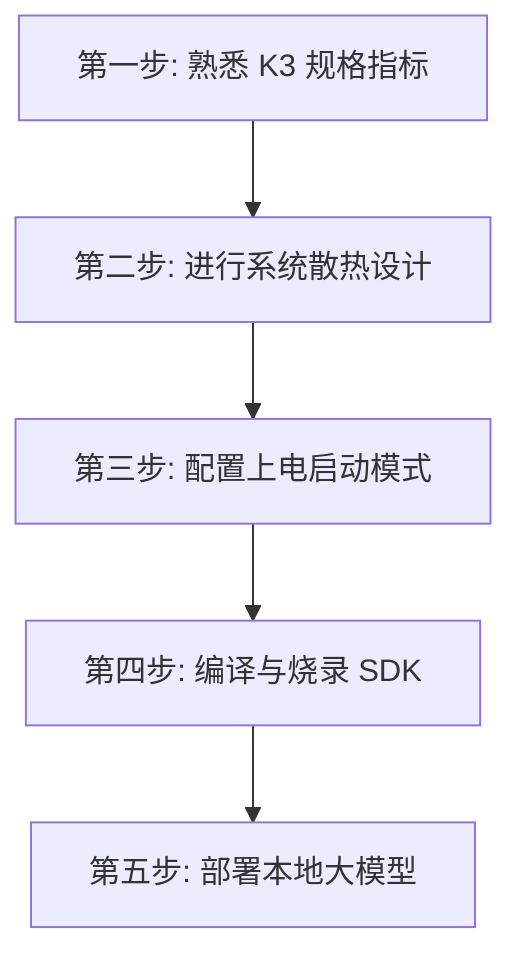

# K3 芯片开发快速上手向导

本向导为开发者提供一条从零开始熟悉 K3 芯片、进行单板硬件散热设计、配置启动模式、到最终在板端跑通本地 30B 大模型的**极简任务动线**。

---

## 🏁 开发者通关动线

### 1. 第一步：熟悉 K3 规格指标
*   **目标**：快速了解 K3 芯片的计算架构与基本接口能力。
*   **行动**：阅读 [K3 产品简介（原始文件）](../Sources/docs-chip/zh/key_stone/k3/k3_docs/root_overview.md)，重点关注通用 X100 计算核与 AI A100 核的数量与主频。

### 2. 第二步：进行系统散热设计
*   **目标**：设计符合 K3 热学指标的散热方案，避免满载过温降频。
*   **行动**：
    *   阅读 **[[Knowledge_Atoms/K3热设计与散热专题档案]]**。
    *   根据其引用的物理热阻与 TDP 功耗限额（参见 [[Evidence/k3_thermal_specs]]），为你的开发板设计主动风冷或金属外壳被动散热。

### 3. 第三步：配置上电启动模式
*   **目标**：设计并检查开发板的 Strap Pins 上下拉电阻，确保芯片能正确从 eMMC/SD/Flash 引导或进入 USB 烧录。
*   **行动**：
    *   阅读 **[[Knowledge_Atoms/K3启动模式与Strap管脚配置专题档案]]**。
    *   对照其中的电平组合表（参见 [[Evidence/k3_strap_pins_config]]），检查硬件原理图上 GPIO65、GPIO66、GPIO69 的电阻连接。

### 4. 第四步：编译并烧录 SDK 系统
*   **目标**：在宿主机上搭建开发环境，编译并烧录最小 Bianbu Linux 系统。
*   **行动**：参考 [K3 SDK 使用指南（原始文件）](../Sources/docs-chip/zh/key_stone/k3/k3_sw/k3_sdk_user_guide.md)，下载源码，执行 `make` 编译出系统镜像，并使用烧录工具写入开发板。

### 5. 第五步：部署本地大模型
*   **目标**：利用 K3 的 60 TOPS AI 算力，在本地流畅运行大语言模型或视觉多模态模型。
*   **行动**：
    *   阅读 **[[Knowledge_Atoms/K3大模型本地推理与AI算力专题档案]]**。
    *   了解大模型量化格式（支持 FP8 原生推理，参见 [[Evidence/k3_ai_performance_data]]）。
    *   使用 AI 工具链编译模型，并在开发板上加载运行，体验端侧 > 10 Tokens/s 的大模型推理。
