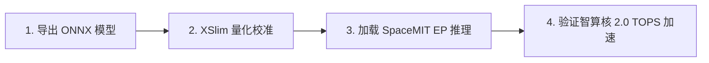

# SpaceAI 模型量化与端侧推理快速上手向导

> [!TIP]
> **💡 工程师导读与排坑焦点**：帮助开发者从模型导出、XSlim 量化校准到使用 `SpaceMITExecutionProvider` 在 K1/K3 上跑通端侧 AI 加速。
> **目标读者**：`AI算法工程师 / 应用开发工程师` | **技术领域**：`edge_ai_robotics`

本向导提供从训练框架模型导出、XSlim 工具链量化校准到使用 ONNX Runtime 在 SpacemiT A60 智算核上执行硬件加速推理的极简通关路线。

---

## 🗺️ 通关路线图



---

## 步骤 1：从 PyTorch 导出 ONNX 基础模型

在主机（Host）开发环境中将模型导出为标准 `.onnx` 格式：

```python
import torch

model = MyVisionModel().eval()
dummy_input = torch.randn(1, 3, 224, 224)
torch.onnx.export(model, dummy_input, "base_model.onnx", input_names=["input"], output_names=["output"])
```

---

## 步骤 2：使用 XSlim 工具链进行模型量化

使用 SpacemiT 官方 **XSlim** 工具对模型进行静态量化与算子融合：

```bash
# 运行 XSlim 量化命令
xslim convert \
    --model base_model.onnx \
    --output quantized_model.onnx \
    --quant-config int8_calib.json \
    --dataset /path/to/calibration_images
```

详细量化配置选项请参考 [[Evidence/space_ai_software_stack_specs|SpaceAI 软件栈与 XSlim 规格]]。

---

## 步骤 3：在 K1/K3 上通过 ONNX Runtime 执行硬件推理

将 `quantized_model.onnx` 拷贝至 K1/K3 开发板（运行 Bianbu OS / Buildroot），调用 `SpaceMITExecutionProvider` 启动硬件加速：

```python
import onnxruntime as ort

# 创建推理 Session 并指定 SpaceMIT 专属 Execution Provider
session = ort.InferenceSession(
    "quantized_model.onnx",
    providers=["SpaceMITExecutionProvider"]
)

# 执行推理
outputs = session.run(None, {"input": input_data})
```

更详细的 AI CPU 智算核同构原理与架构请参阅 [[Evidence/space_ai_architecture_specs|A60 AI CPU 智算核规格]] 与 [[Knowledge_Atoms/SpaceAI_端侧大模型量化与部署专题档案|SpaceAI 端侧大模型量化与部署专题档案]]。
