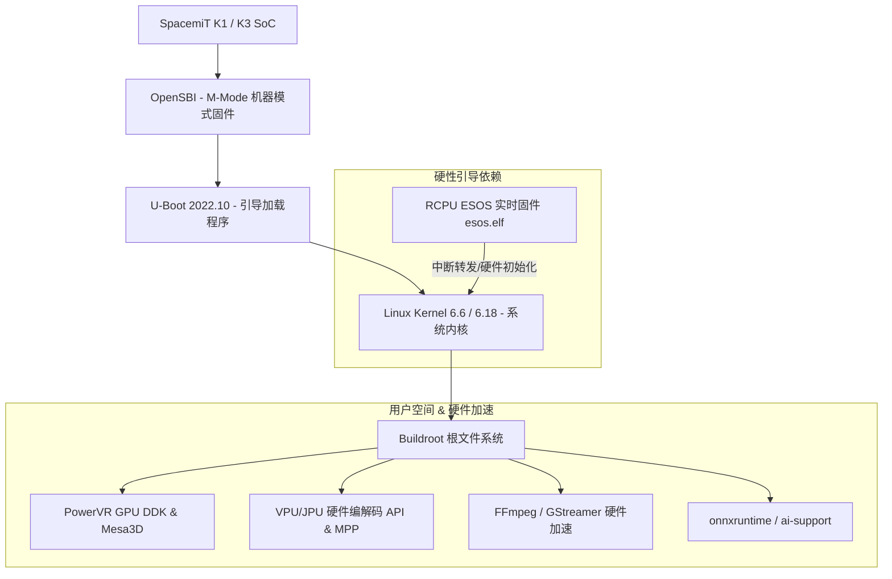

# Buildroot 嵌入式系统定制与内核编译专题档案

> [!TIP]
> **💡 工程师导读与排坑焦点**：详解 SDK 目录架构、Docker/宿主机编译、linux-menuconfig 与 esos.elf 依赖。
> **目标读者**：`BSP 工程师 / 驱动工程师` | **技术领域**：`bsp_kernel_drivers`

本专题档案解构基于 SpacemiT K1 与 K3 RISC-V 芯片的 Buildroot SDK 体系架构。涵盖代码获取 (Repo)、Docker/宿主机编译环境配置、方案选项配置 (`defconfig`)、内核与 Bootloader 选项微调 (`linux-menuconfig` / `uboot-menuconfig`)、GPU/VPU/RCPU 多媒体中间件集成，以及镜像输出与卡刻刷机。

---

## 1. SDK 系统架构与核心组件解构

SpacemiT Buildroot SDK 是专为 K 系列 RISC-V SoC 打造的底层 Linux 支持包（BSP）。系统采用了典型的分层引导与中间件框架：



详细的各组件版本及文件路径分配请参考 [[Evidence/buildroot_bsp_specs|SpacemiT Buildroot BSP 规格表]]。

---

## 2. 源码下载与仓库结构管理

### 2.1 Repo 清单下载与版本分支选择

Buildroot 代码由多个独立的 Git 存储库组成，统一使用 Google `repo` 工具进行同步管理。根据开发的目标芯片与分支要求选择对应的 `manifest.xml`：

* **K1 平台**：主推 `k1-bl-v2.2.y.xml`（发布于 GitHub/Gitee）。
* **K3 平台**：主推 `k3-br-v1.0.y.xml`（发布于 GitHub/Gitee）。

具体的版本切换与离线依赖加速拉取命令请查阅 [[Evidence/buildroot_compilation_parameters|Buildroot 编译指令与离线包下载参数]]。

### 2.2 SDK 源码目录拓扑

```shell
buildroot-sdk/
├── bsp-src/               # 核心 BSP 源码 (linux-6.6/6.18, opensbi, uboot-2022.10)
├── buildroot/             # 上游 Buildroot 主框架
├── buildroot-ext/         # SpacemiT 扩展 (board, configs, package, patches)
├── package-src/           # 硬件加速 API 源码 (drm-test, esos, mpp, vpu-firmware, mesa3d)
├── Makefile               # 顶层构建入口
└── scripts/               # 自动构建辅助脚本
```

---

## 3. 开发环境配置与 Docker 容器构建

### 3.1 容器化构建模式（推荐）

自 Buildroot 2.2.7 (K1) 及 1.0 (K3) 起，SDK 引入了预构建 Docker 容器支持。
* **好处**：无需在宿主机配置复杂且易冲突的 Python/Toolchain 交叉编译依赖，保证团队构建环境的 100% 一致。
* **用法**：安装好 Docker CE 后直接执行 Makefile 构建命令，脚本会自动拉取并进入构建容器。

### 3.2 宿主机直接编译模式

如需在 Host 主机上直接编译，必须显式导出环境变量：
```bash
export DIRECT_BUILD=1
```
详细的 Ubuntu 依赖软件包列表详见 [[Evidence/buildroot_bsp_specs|Buildroot 宿主机依赖规格]]。

---

## 4. 交叉编译与方案配置 (`defconfig`)

### 4.1 方案选择与第一次编译 (`make envconfig`)

首次构建项目，推荐通过交互式菜单配置方案：
```bash
cd ~/buildroot-sdk
make envconfig
```
预置方案选择说明：
* **K1 完整方案**：选择 `spacemit_k1_v2_defconfig` (索引 `5`)，集成 GPU/VPU/QT5 全套多媒体。
* **K1 硬实时方案**：选择 `spacemit_k1_rt_defconfig` (索引 `4`)，启用 PREEMPT_RT 实时内核补丁。
* **K3 方案**：选择 `spacemit_k3_defconfig` (索引 `2`) 或 `spacemit_k3_rt_defconfig` (索引 `4`)。

### 4.2 快捷 Make 命令行集

新版 SDK 提倡使用单行无交互命令进行项目编译与菜单微调：

* **单行编译全套镜像**：`make k1_v2-build` 或 `make k3-build`
* **图形化定制 Linux 内核**：`make k1_v2-linux-menuconfig`
* **图形化定制 U-Boot**：`make k1_v2-uboot-menuconfig`
* **重新编译单一模块**：`make k1_v2-pkg PKG=mpp`

所有的 Make 完整指令列表详见 [[Evidence/buildroot_compilation_parameters|Buildroot Make 快捷指令表]]。

---

## 5. RCPU ESOS 实时固件与系统启动红线

> [!WARNING]
> 在基于 Buildroot 自定义裁剪 Rootfs 或构建第三方 Linux 系统（如 Debian/Ubuntu）时，**绝对不可遗漏 `esos.elf` 固件**。

RCPU 实时协处理器固件 `esos.elf` 负责板级硬件模块初始化及 HDMI Audio 中断转发。若缺省，内核引导将挂起死锁。
硬件与启动红线规范细节请参考 [[Evidence/esos_rcpu_firmware_specs|SpacemiT RCPU (ESOS) 固件与启动依赖硬规范]] 以及 [[Knowledge_Atoms/K1系统启动与分区配置专题档案|K1 系统启动与分区配置专题]]。

---

## 6. 生态板卡部署与镜像输出

编译成功后，产物保存在 `output/<solution>/images/` 目录下：

1. **Titan Flasher 线刷**：使用 `buildroot-<solution>.zip` 镜像。
2. **SD 卡本地刻录**：使用 `sdcard.img`，利用 `dd` 命令刻录至 TF/SD 卡并设置 Strap 引脚选通启动。

开发板板级硬件与 Strap 拨码开关设计请参考 [[Knowledge_Atoms/Muse_Pi_板级硬件设计专题|Muse Pi 板级硬件设计专题]] 及 [[Knowledge_Atoms/K1启动模式与Strap管脚配置专题档案|K1 启动模式与 Strap 管脚配置专题]]。
