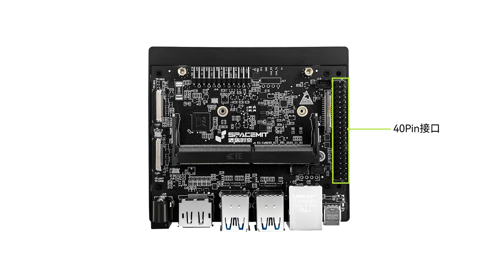

# K3 CoM260 40-Pin IOMAP 与扩展接口管脚映射专题档案

> [!TIP]
> **💡 工程师与 AI-Agent 导读**：本专题汇总了基于 SpacemiT K3 芯片的核心板开发套件 **K3 CoM260** 的 40-Pin 标准扩展排针及外设接口定义。
> * **原始数据源**：[com260_user_guide.md:L311-L340](file:///Users/bicycle/Spacemit%20LLM%20Wiki/Sources/docs-product/en/k3_com260/com260_user_guide.md#L311-L340)
> * **板级设计关联**：[[Knowledge_Atoms/K3_COM260_板级硬件设计专题|K3 COM260 板级硬件设计专题]]

### 板卡物理排针位置图

---

## 1. 40-Pin 扩展插针结构化映射总表

K3 CoM260 开发板提供符合 Raspberry Pi 兼容规范的 40-Pin 双排扩展排针，电平主要经过电平转换芯片（LS）处理：

| Pin (左) | 信号名称 (Signal Name) | Pin (右) | 信号名称 (Signal Name) | 主要功能 / 模块 | 电压等级 |
| :---: | :--- | :---: | :--- | :--- | :--- |
| **1** | `VDD_3V3_SYS` | **2** | `VDD_5V_GPIO` | 系统 3.3V / 5.0V 电源 | 3.3V / 5.0V |
| **3** | `I2C3_SDA` | **4** | `VDD_5V_GPIO` | I2C3 数据线 / 5V 电源 | 3.3V / 5.0V |
| **5** | `I2C3_SCL` | **6** | `GND` | I2C3 时钟线 / 参考地 | 3.3V / 0V |
| **7** | `GPIO09` | **8** | `UART1_TXD_LS` | 通用 GPIO / UART1 发送 | 3.3V |
| **9** | `GND` | **10** | `UART1_RXD_LS` | 参考地 / UART1 接收 | 0V / 3.3V |
| **11** | `UART1_RTS_LS` | **12** | `I2S0_SCLK_LS` | UART1 流控 / I2S0 位时钟 | 3.3V |
| **13** | `R-SPI0_SCK_LS` | **14** | `GND` | R-SPI0 时钟线 / 参考地 | 3.3V / 0V |
| **15** | `GPIO12_LS` | **16** | `R-SPI0_CS1_LS` | 通用 GPIO / R-SPI0 片选1 | 3.3V |
| **17** | `VDD_3V3_SYS` | **18** | `R-SPI0_CS_LS` | 3.3V 电源 / R-SPI0 主片选 | 3.3V |
| **19** | `SPI0_MOSI_LS` | **20** | `GND` | SPI0 主出从入 / 参考地 | 3.3V / 0V |
| **21** | `SPI0_MISO_LS` | **22** | `R-SPI0_MISO_LS` | SPI0 主入从出 / R-SPI0 数据输入 | 3.3V |
| **23** | `SPI0_SCK_LS` | **24** | `SPI0_CS0_LS` | SPI0 时钟线 / SPI0 片选0 | 3.3V |
| **25** | `GND` | **26** | `SPI0_CS1_LS` | 参考地 / SPI0 片选1 | 0V / 3.3V |
| **27** | `I2C0_SDA` | **28** | `I2C0_SCL` | I2C0 数据线 / I2C0 时钟线 | 3.3V |
| **29** | `GPIO01_LS` | **30** | `GND` | 通用 GPIO / 参考地 | 3.3V / 0V |
| **31** | `GPIO11_LS` | **32** | `GPIO07_LS` | 通用 GPIO / 通用 GPIO | 3.3V |
| **33** | `GPIO13_LS` | **34** | `GND` | 通用 GPIO / 参考地 | 3.3V / 0V |
| **35** | `I2S0_LRCK_LS` | **36** | `UART1_CTS_LS` | I2S0 帧时钟 / UART1 流控 | 3.3V |
| **37** | `R-SPI0_MOSI_LS` | **38** | `I2S0_SDIN_LS` | R-SPI0 数据输出 / I2S0 音频输入 | 3.3V |
| **39** | `GND` | **40** | `I2S0_SDOUT_LS` | 参考地 / I2S0 音频输出 | 0V / 3.3V |

---

## 2. 主要外设接口速查表

### 2.1 串口与 I2C 总线映射
| 外设模块 | 对应 Pin 脚 | 关键信号 | DTS 设备树节点 |
| :--- | :--- | :--- | :--- |
| **UART1 (带流控)** | Pin 8 (TX), Pin 10 (RX), Pin 11 (RTS), Pin 36 (CTS) | `UART1_*_LS` | `&uart1` |
| **I2C0 总线** | Pin 27 (SDA), Pin 28 (SCL) | `I2C0_*` | `&i2c0` |
| **I2C3 总线** | Pin 3 (SDA), Pin 5 (SCL) | `I2C3_*` | `&i2c3` |

### 2.2 SPI 与 音频 (I2S) 映射
| 外设模块 | 对应 Pin 脚 | 信号明细 |
| :--- | :--- | :--- |
| **SPI0 总线** | Pin 19 (MOSI), Pin 21 (MISO), Pin 23 (SCK), Pin 24 (CS0), Pin 26 (CS1) | `SPI0_*_LS` |
| **R-SPI0 总线** | Pin 37 (MOSI), Pin 22 (MISO), Pin 13 (SCK), Pin 18 (CS0), Pin 16 (CS1) | `R-SPI0_*_LS` |
| **I2S0 音频** | Pin 12 (SCLK), Pin 35 (LRCK), Pin 38 (SDIN), Pin 40 (SDOUT) | `I2S0_*_LS` |

---

## 3. 关联知识节点

* 核心板详细设计：[[Knowledge_Atoms/K3_COM260_板级硬件设计专题|K3 COM260 板级硬件设计专题]]
* 事实规格：[[Evidence/k3_com260_specs|K3 COM260 硬件规格事实]]
