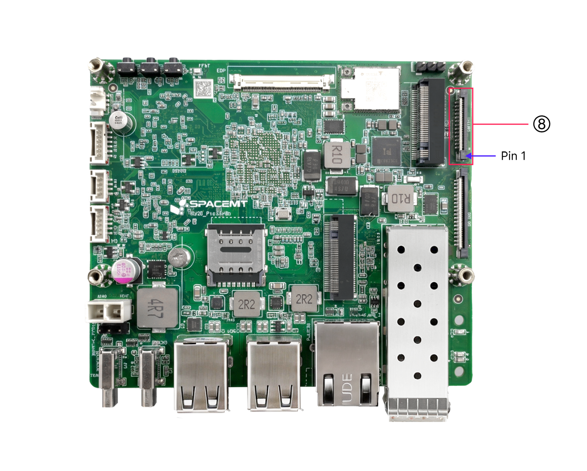
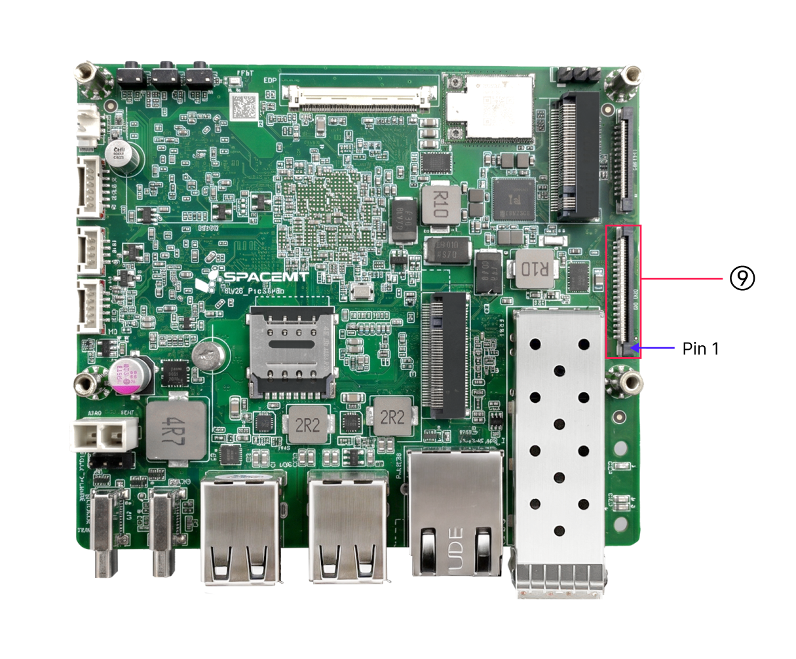

# K3 Pico 26-Pin与36-Pin扩展接口管脚映射专题档案

> [!TIP]
> **💡 工程师与 AI-Agent 导读**：本专题汇总了基于 SpacemiT K3 芯片的 Pico-ITX 工业单板计算机 **K3 Pico** 的 26-Pin 与 36-Pin FPC 扩展接口映射。
> * **原始数据源**：[pico_user_guide.md:L438-L519](file:///Users/bicycle/Spacemit%20LLM%20Wiki/Sources/docs-product/en/k3_pico/pico_user_guide.md#L438-L519)
> * **板级设计关联**：[[Knowledge_Atoms/K3_Pico_板级硬件设计专题|K3 Pico 板级硬件设计专题]]

### 板卡物理扩展接口位置图 (含 Pin 1 标记)

---

## 1. 26-Pin FPC 扩展接口总表 (3.3V 电源域)

26-Pin FPC 接口引出了包含 RT24 协处理器的 CAN 总线、I2C、多路 UART 与 PWM 信号：

| Pin (物理针脚) | 信号名称 (Signal) | 功能描述 (Description) | 电压等级 | 关联模块 |
| :---: | :--- | :--- | :---: | :--- |
| **1** | `3.3V` | 3.3V 主 IO 电源 | 3.3V | 系统电源 |
| **2** | `3.3V` | 3.3V 主 IO 电源 | 3.3V | 系统电源 |
| **3** | `R_I2C1_SCL` | I2C1 时钟线 | 3.3V | `&i2c1` |
| **4** | `R_I2C1_SDA` | I2C1 数据线 | 3.3V | `&i2c1` |
| **5** | `GND` | 参考地 | 0V | 地 |
| **6** | `R_UART0_TX` | UART0 发送 | 3.3V | RCPU Console |
| **7** | `R_UART0_RX` | UART0 接收 | 3.3V | RCPU Console |
| **8** | `GND` | 参考地 | 0V | 地 |
| **9** | `UART5_TX` | UART5 发送 | 3.3V | `&uart5` |
| **10** | `UART5_RX` | UART5 接收 | 3.3V | `&uart5` |
| **11** | `RX_PWM1` | PWM 输出 1 | 3.3V | `&pwm1` |
| **12** | `RX_PWM2` | PWM 输出 2 | 3.3V | `&pwm2` |
| **13** | `UART10_TX` | UART10 发送 | 3.3V | `&uart10` |
| **14** | `UART10_RX` | UART10 接收 | 3.3V | `&uart10` |
| **15** | `UART10_CTS` | UART10 流控 (CTS) | 3.3V | `&uart10` |
| **16** | `UART10_RTS` | UART10 流控 (RTS) | 3.3V | `&uart10` |
| **17** | `GND` | 参考地 | 0V | 地 |
| **18** | `R_CAN4_TX` | RT24 CAN4 发送 | 3.3V | `&can4` |
| **19** | `R_CAN4_RX` | RT24 CAN4 接收 | 3.3V | `&can4` |
| **20** | `GND` | 参考地 | 0V | 地 |
| **21** | `R_CAN3_TX` | RT24 CAN3 发送 | 3.3V | `&can3` |
| **22** | `R_CAN3_RX` | RT24 CAN3 接收 | 3.3V | `&can3` |
| **23** | `GND` | 参考地 | 0V | 地 |
| **24** | `R_CAN2_TX` | RT24 CAN2 发送 | 3.3V | `&can2` |
| **25** | `R_CAN2_RX` | RT24 CAN2 接收 | 3.3V | `&can2` |
| **26** | `GND` | 参考地 | 0V | 地 |

---

## 2. 36-Pin FPC 高速/以太网扩展接口总表 (1.8V 电源域)

36-Pin FPC 接口主要用于扩展第二个 GMAC-MII 以太网口、SPI 及 CAN0/CAN1 工业总线：

| Pin | 信号名称 (Signal) | 功能描述 (Description) | 电压等级 | 模块分类 |
| :---: | :--- | :--- | :---: | :--- |
| **1~2** | `1.8V` | 1.8V 主 IO 电源 | 1.8V | 系统电源 |
| **3~4** | `CAN1_RX` / `CAN1_TX` | CAN1 接收 / 发送 | 1.8V | CAN 总线 |
| **5, 7, 12, 14, 19, 29, 34** | `GND` | 参考地隔离脚 | 0V | 地隔离 |
| **6** | `R_TX_CLK` | MAC 发送时钟 | 1.8V | GMAC-MII 以太网 |
| **8~11** | `R_TX_D0 ~ D3` | MAC 发送数据 0~3 | 1.8V | GMAC-MII 以太网 |
| **13** | `R_RX_CLK` | MAC 接收时钟 | 1.8V | GMAC-MII 以太网 |
| **15~18** | `R_RX_D0 ~ D3` | MAC 接收数据 0~3 | 1.8V | GMAC-MII 以太网 |
| **20** | `R_TX_EN` | MAC 发送使能 | 1.8V | GMAC-MII 以太网 |
| **21** | `R_CLK_25M` | 25 MHz 参考时钟输出 | 1.8V | 以太网 PHY |
| **22** | `R_RX_DV` | MAC 接收有效 | 1.8V | GMAC-MII 以太网 |
| **23** | `R_PWDN/INTn` | 以太网 PHY 中断/低功耗 | 1.8V | 以太网 PHY |
| **24** | `R_RESETn` | 以太网 PHY 复位 | 1.8V | 以太网 PHY |
| **25~26** | `R_MDIO_MDC` / `R_MDIO_MDIO` | MDIO 时钟与数据 | 1.8V | 以太网 PHY 管理 |
| **27~28** | `R_CRS` / `R_COL` | 载波监听 / 冲突检测 | 1.8V | GMAC-MII 以太网 |
| **30~33** | `SPI0_MOSI/MISO/SCLK/CS` | SPI0 主从总线 | 1.8V | `&spi0` |
| **35~36** | `R_CAN0_TX` / `R_CAN0_RX` | RT24 CAN0 发送 / 接收 | 1.8V | CAN 总线 |

---

## 3. 关联知识节点

* 板级综合设计：[[Knowledge_Atoms/K3_Pico_板级硬件设计专题|K3 Pico 板级硬件设计专题]]
* 物理规格事实：[[Evidence/k3_pico_specs|K3 Pico 硬件规格事实]]
