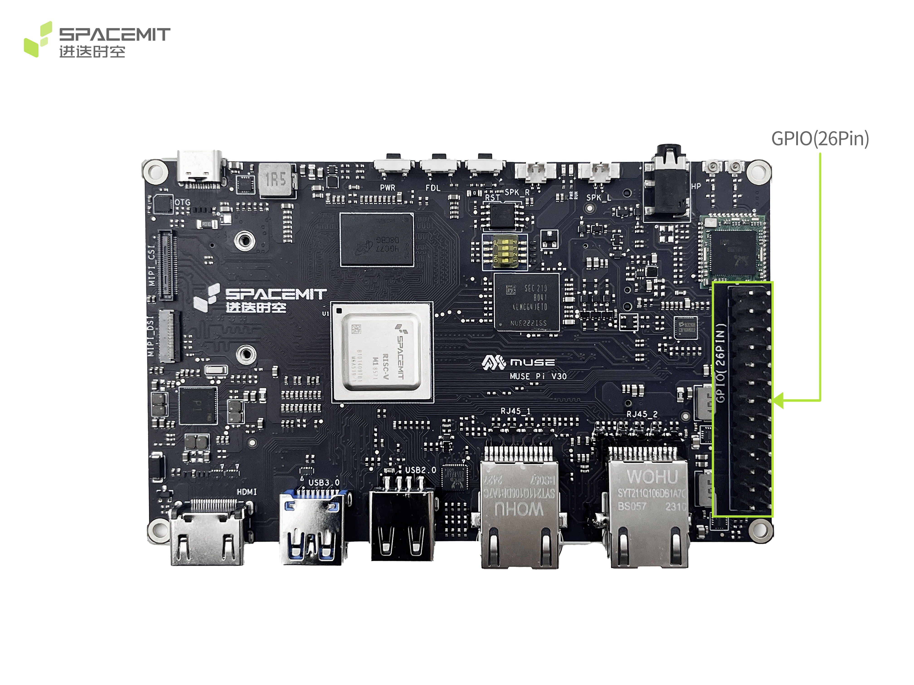

# MUSE Pi 26-Pin IOMAP 与外设管脚复用专题档案

> [!TIP]
> **💡 工程师与 AI-Agent 导读**：本专题汇总了基于 SpacemiT K1 芯片的生态板卡 MUSE Pi / MUSE Pi Pro 的 26-Pin 扩展双排插针定义。
> * **原始数据源**：[pi_user_guide.md:L495-L588](file:///Users/bicycle/Spacemit%20LLM%20Wiki/Sources/docs-product/en/k1_muse_pi/pi_user_guide.md#L495-L588)
> * **硬件芯片关联**：[[Knowledge_Atoms/K1硬件外设接口与物理调试专题档案|K1 硬件外设接口专题]] | [[Knowledge_Atoms/Muse_Pi_板级硬件设计专题|Muse Pi 板级设计专题]]

### 板卡物理排针位置图

---

## 1. 26-Pin 扩展接口结构化映射总表

下表记录了 26-Pin 双排插针（J26）从 Pin 1 到 Pin 26 的物理对应关系。加粗项为系统出厂默认配置功能：

| Pin (针脚) | 信号名称 (Net Name) | 默认功能 (Default Function) | 芯片 GPIO / 管脚 | 可选复用功能 (Alt Functions) | 电压等级 | 关联模块 / DTS |
| :--- | :--- | :--- | :--- | :--- | :--- | :--- |
| **1** | `VCC3V3_SYS` | **3.3V 主电源输出** | - | - | 3.3V | 系统电源 |
| **2** | `VCC5V0_OUT` | **5.0V 主电源输出** | - | - | 5.0V | 系统电源 |
| **3** | `AP_I2C4_SDA_3V3` | **I2C4 数据 (SDA)** | `GPIO_52` | R_SPI_RXD, R_UART1_RXD, R_PWM7 | 3.3V | `&i2c4` |
| **4** | `VCC5V0_OUT` | **5.0V 主电源输出** | - | - | 5.0V | 系统电源 |
| **5** | `AP_I2C4_SCL_3V3` | **I2C4 时钟 (SCL)** | - | R_SPI_TXD, R_UART1_TXD, R_PWM6 | 3.3V | `&i2c4` |
| **6** | `GND` | **电源地** | - | - | 0V | RCPU UART 参考地 |
| **7** | `PRI_TDI` | **Primary JTAG TDI** | `GPIO_70` | AP_I2C2_SCL_3V3, UART5_TXD | 3.3V | J-Link / OpenOCD |
| **8** | `R_UART0_TXD_3V3` | **RCPU 调试 TX** | `GPIO_47` | R_CAN_TX0, R_PWM8, AP_I2C3_SCL | 3.3V | RCPU 实时核 Console |
| **9** | `GND` | **电源地** | - | - | 0V | 地 |
| **10** | `R_UART0_RXD_3V3` | **RCPU 调试 RX** | `GPIO_48` | R_CAN_RX0, R_IR_RX, AP_I2C3_SDA, KP_MKOUT[2] | 3.3V | RCPU 实时核 Console |
| **11** | `GPIO_71_3V3` | **通用 GPIO** | `GPIO_71` | PRI_TMS, AP_I2C2_SDA_3V3, UART5_RXD | 3.3V | JTAG TMS 复用 |
| **12** | `GPIO_74_3V3` | **通用 GPIO** | `GPIO_74` | R_PWM9, PCIe2_WAKEN | 3.3V | PCIe / PWM 复用 |
| **13** | `GPIO_72_3V3` | **通用 GPIO** | `GPIO_72` | PRI_TCK, UART9_TXD, UART5_CTS_N | 3.3V | JTAG TCK 复用 |
| **14** | `GND` | **电源地** | - | - | 0V | 地 |
| **15** | `GPIO_73_3V3` | **通用 GPIO** | `GPIO_73` | PRI_TDO, UART9_RXD, UART5_RTS_N | 3.3V | JTAG TDO 复用 |
| **16** | `GPIO_91_3V3` | **通用 GPIO** | `GPIO_91` | MN_CLK2, DSI_TE, R_I2C0_SCL | 3.3V | 显示 TE / I2C 复用 |
| **17** | `VCC3V3_SYS` | **3.3V 主电源输出** | - | - | 3.3V | 系统电源 |
| **18** | `GPIO_92_3V3` | **通用 GPIO** | `GPIO_92` | MN_CLK, PWM7, R_I2C0_SDA | 3.3V | PWM / I2C 复用 |
| **19** | `SPI3_MOSI_3V3` | **SPI3 主输出从输入** | `GPIO_77` | SPI2_MOSI, AP_I2C3_SCL, UART8_CTS_N, R_PWM0 | 3.3V | `&spi3` |
| **20** | `GND` | **电源地** | - | - | 0V | 地 |
| **21** | `SPI3_MISO_3V3` | **SPI3 主输入从输出** | `GPIO_78` | SPI2_MISO, AP_I2C3_SDA, UART8_RTS_N, R_PWM1 | 3.3V | `&spi3` |
| **22** | `GPIO_49_3V3` | **通用 GPIO** | `GPIO_49` | R_SPI_SCLK, R_UART1_CTS_N, R_PWM4, R_I2C0_SCL | 3.3V | SPI / UART 复用 |
| **23** | `SPI3_SCLK_3V3` | **SPI3 时钟** | `GPIO_75` | SPI2_SCLK, CAN_TX0, UART8_TXD, AP_I2C4_SCL | 3.3V | `&spi3` / `&can0` |
| **24** | `SPI3_CS_3V3` | **SPI3 片选** | `GPIO_76` | SPI2_CS, CAN_RX0, UART8_RXD, AP_I2C4_SDA | 3.3V | `&spi3` / `&can0` |
| **25** | `GND` | **电源地** | - | - | 0V | 地 |
| **26** | `GPIO_50_3V3` | **通用 GPIO** | `GPIO_50` | R_SPI_FRM, R_UART1_RTS_N, R_PWM5, R_I2C0_SDA | 3.3V | PWM / I2C 复用 |

---

## 2. 核心功能速查路由表

### 2.1 Primary JTAG 物理引脚映射
当需要使用 J-Link 仿真器通过 26-Pin 扩展接口调试 K1 主控核时：

| JTAG 信号 | 26-Pin 引脚 | 芯片管脚 | 说明 |
| :--- | :--- | :--- | :--- |
| **VTref (3.3V)** | Pin 1 | `VCC3V3_SYS` | 参考电压 |
| **TDI** | Pin 7 | `GPIO_70` | JTAG 数据输入 |
| **TMS** | Pin 11 | `GPIO_71` | JTAG 状态机控制 |
| **TCK** | Pin 13 | `GPIO_72` | JTAG 时钟输入 |
| **TDO** | Pin 15 | `GPIO_73` | JTAG 数据输出 |
| **GND** | Pin 9 / 14 | `GND` | 参考地 |

### 2.2 RCPU 调试串口 (UART)
| 调试通道 | 26-Pin 引脚 | 芯片 GPIO | 电平 & 波特率 |
| :--- | :--- | :--- | :--- |
| **RCPU TX** | Pin 8 | `GPIO_47` | 3.3V / 115200 |
| **RCPU RX** | Pin 10 | `GPIO_48` | 3.3V / 115200 |
| **GND** | Pin 6 | `GND` | 0V |

### 2.3 CAN 总线复用映射 (CAN0)
| CAN 信号 | 26-Pin 引脚 | 芯片 GPIO | 需配置模式 |
| :--- | :--- | :--- | :--- |
| **CAN0_TX** | Pin 23 | `GPIO_75` | Alt Function 3 (CAN_TX0) |
| **CAN0_RX** | Pin 24 | `GPIO_76` | Alt Function 3 (CAN_RX0) |

---

## 3. 关联知识节点

* 板级设计综合：[[Knowledge_Atoms/Muse_Pi_板级硬件设计专题|Muse Pi 板级硬件设计专题]]
* 物理调试手册：[[Knowledge_Atoms/K1硬件外设接口与物理调试专题档案|K1 硬件外设接口与物理调试专题]]
* 规格与参数对比：[[Evidence/muse_pi_vs_pi_pro_specs|Muse Pi 物理规格事实]]
