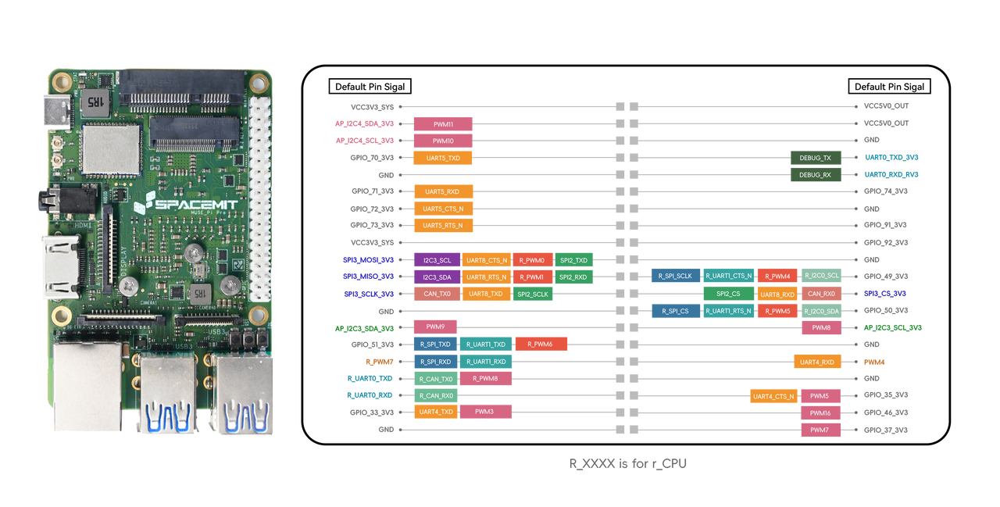

# MUSE Pi Pro 40-Pin IOMAP 与外设管脚复用专题档案

> [!TIP]
> **💡 工程师与 AI-Agent 导读**：本专题汇总了基于 SpacemiT K1 芯片的升级版生态开发板 **MUSE Pi Pro** 的 40-Pin 扩展双排插针定义。
> * **原始数据源**：[pi_pro_user_guide.md:L450-L485](file:///Users/bicycle/Spacemit%20LLM%20Wiki/Sources/docs-product/en/k1_muse_pi_pro/pi_pro_user_guide.md#L450-L485)
> * **板级设计关联**：[[Knowledge_Atoms/Muse_Pi_板级硬件设计专题|Muse Pi / Pro 板级硬件设计专题]]

### 板卡物理排针与彩色功能映射图

---

## 1. 40-Pin 扩展插针结构化映射总表

MUSE Pi Pro 开发板将扩展排针升级为 40-Pin 兼容规范：

| Pin (左) | 信号名称 / 默认功能 | Pin (右) | 信号名称 / 默认功能 | 复用与模块说明 | 电压等级 |
| :---: | :--- | :---: | :--- | :--- | :---: |
| **1** | `VCC3V3_SYS` (3.3V电源) | **2** | `VCC5V0_OUT` (5.0V电源) | 系统主电源输出 | 3.3V / 5.0V |
| **3** | `AP_I2C4_SDA_3V3` | **4** | `VCC5V0_OUT` (5.0V电源) | I2C4 数据线 (Alt: PWM11) / 5V电源 | 3.3V / 5.0V |
| **5** | `AP_I2C4_SCL_3V3` | **6** | `GND` (电源地) | I2C4 时钟线 (Alt: PWM10) / 参考地 | 3.3V / 0V |
| **7** | `GPIO_70_3V3` | **8** | `UART0_TXD_3V3` | GPIO_70 (Alt: UART5_TXD) / X60 Debug TX | 3.3V |
| **9** | `GND` (电源地) | **10** | `UART0_RXD_3V3` | 参考地 / X60 Debug RX | 0V / 3.3V |
| **11** | `GPIO_71_3V3` | **12** | `GPIO_74_3V3` | GPIO_71 (Alt: UART5_RXD) / GPIO_74 | 3.3V |
| **13** | `GPIO_72_3V3` | **14** | `GND` (电源地) | GPIO_72 (Alt: UART5_CTS_N) / 参考地 | 3.3V / 0V |
| **15** | `GPIO_73_3V3` | **16** | `GPIO_91_3V3` | GPIO_73 (Alt: UART5_RTS_N) / GPIO_91 | 3.3V |
| **17** | `VCC3V3_SYS` (3.3V电源) | **18** | `GPIO_92_3V3` | 3.3V电源 / GPIO_92 | 3.3V |
| **19** | `SPI3_MOSI_3V3` | **20** | `GND` (电源地) | SPI3 MOSI (Alt: I2C3_SCL, UART8_CTS, R_PWM0) | 3.3V / 0V |
| **21** | `SPI3_MISO_3V3` | **22** | `GPIO_49_3V3` | SPI3 MISO (Alt: I2C3_SDA, UART8_RTS) / R_SPI_SCLK | 3.3V |
| **23** | `SPI3_SCLK_3V3` | **24** | `SPI3_CS_3V3` | SPI3 SCLK (Alt: CAN_TX0, SPI2_SCLK) / SPI3 CS | 3.3V |
| **25** | `GND` (电源地) | **26** | `GPIO_50_3V3` | 参考地 / GPIO_50 (Alt: R_SPI_CS, R_PWM5) | 0V / 3.3V |
| **27** | `AP_I2C3_SDA_3V3` | **28** | `AP_I2C3_SCL_3V3` | I2C3 数据线 (Alt: PWM9) / I2C3 时钟线 (Alt: PWM8) | 3.3V |
| **29** | `GPIO_51_3V3` | **30** | `GND` (电源地) | GPIO_51 (Alt: R_SPI_TXD, R_PWM6) / 参考地 | 3.3V / 0V |
| **31** | `GPIO_52_3V3` | **32** | `GPIO_34_3V3` | GPIO_52 (Alt: R_SPI_RXD) / GPIO_34 (Alt: UART4_RXD) | 3.3V |
| **33** | `GPIO_47_3V3` | **34** | `GND` (电源地) | RCPU UART0 TX (Alt: R_CAN_TX0) / 参考地 | 3.3V / 0V |
| **35** | `GPIO_48_3V3` | **36** | `GPIO_35_3V3` | RCPU UART0 RX (Alt: R_CAN_RX0) / GPIO_35 (Alt: PWM5) | 3.3V |
| **37** | `GPIO_33_3V3` | **38** | `GPIO_46_3V3` | GPIO_33 (Alt: UART4_TXD, PWM3) / GPIO_46 (Alt: PWM16) | 3.3V |
| **39** | `GND` (电源地) | **40** | `GPIO_37_3V3` | 参考地 / GPIO_37 (Alt: PWM7) | 0V / 3.3V |

---

## 2. 调试与多总线通道速查

* **X60 主核 Console 调试串口**：Pin 8 (`UART0_TXD`), Pin 10 (`UART0_RXD`), Pin 6 (`GND`)。
* **RCPU 实时核调试串口**：Pin 33 (`GPIO_47 / R_UART0_TX`), Pin 35 (`GPIO_48 / R_UART0_RX`)。
* **SPI3 扩展接口**：Pin 19 (`MOSI`), Pin 21 (`MISO`), Pin 23 (`SCLK`), Pin 24 (`CS`)。
* **CAN0 总线通道**：Pin 23 (`CAN_TX0`), Pin 24 (`CAN_RX0`)。

---

## 3. 关联知识节点

* 板级硬件综合：[[Knowledge_Atoms/Muse_Pi_板级硬件设计专题|Muse Pi / Pro 板级硬件设计专题]]
* Muse Pi 标准版：[[Knowledge_Atoms/MUSE_Pi_26Pin_IOMAP管脚映射专题|Muse Pi 26-Pin IOMAP 管脚映射专题]]
