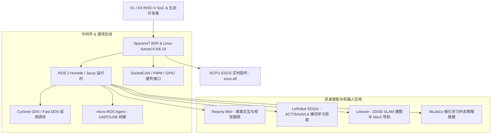

# SpacemiT ROS 2 机器人与具身智能专题档案

> [!TIP]
> **💡 工程师导读与排坑焦点**：详解 ROS 2 架构、micro-ROS 串口总线、LeRobot SO101 ACT 模仿学习与 SLAM 导航。
> **目标读者**：`机器人工程师 / 具身 AI 开发者` | **技术领域**：`edge_ai_robotics`

本专题档案系统性解构基于 SpacemiT K1 与 K3 RISC-V 芯片平台的 ROS 2（Robot Operating System）软件架构与具身智能（Embodied AI）应用生态。包含 ROS 2 Humble/Jazzy 运行时搭建、DDS 通信调优、micro-ROS 串口/硬件总线桥接、模仿学习模型 (ACT / SmolVLA) 端侧部署，以及 Reachy Mini、SO101 机械臂、Linksee 移动机器人的开发实践。

---

## 1. ROS 2 系统架构与中间件集成

SpacemiT 为端侧机器人开发提供了从底层 Linux 内核到上层机器人框架的全栈支持：



具体的 ROS 2 发行版与节点开销数据请查阅 [[Evidence/ros2_platform_specs|SpacemiT ROS 2 平台规格表]]。

---

## 2. ROS 2 环境配置与 DDS 调优

### 2.1 Bianbu OS 与 Docker 部署

可以在 Bianbu OS (Debian-based) 或 Ubuntu 24.04 上直接通过 `apt` 安装 ROS 2 二进制包，也可直接启动官方预构建 Docker 镜像：

```bash
# 启动 ROS 2 镜像容器
docker run -it --net=host --privileged -v /dev:/dev spacemit/ros:humble-desktop
```

### 2.2 多节点 DDS 网络通信优化

对于需要同时传输 MIPI CSI 图像帧或 3D 激光雷达点云的机器人节点，利用 K1/K3 芯片的双 GMAC 以太网与 Cyclone DDS 进行多播流量调优：

```bash
export RMW_IMPLEMENTATION=rmw_cyclonedds_cpp
```

详细参数见 [[Evidence/ros2_platform_specs|ROS 2 平台支持与 DDS 参数]]。

---

## 3. micro-ROS 与底层硬件总线桥接

为了实现毫秒级硬件电机控制，SpacemiT 方案支持将高层逻辑运行于 K1/K3 主核，而将底层 PWM / 编码器计数交付给协同 MCU，并通过 `micro-ROS` 节点通信：

```bash
# 启动 micro-ROS Agent 串口节点
ros2 run micro_ros_agent micro_ros_agent serial --dev /dev/ttyS1 -b 115200
```

板级 JTAG / UART 与串口物理排针参考 [[Knowledge_Atoms/Muse_Pi_板级硬件设计专题|Muse Pi 板级硬件设计专题]] 与 [[Knowledge_Atoms/K3_COM260_板级硬件设计专题|K3 COM260 板级硬件设计专题]]。

---

## 4. 具身智能 (Embodied AI) 模仿学习与端侧部署

### 4.1 SO101 机械臂与 LeRobot 框架

SpacemiT 芯片集成了 RISC-V Vector 指令扩展与 2.0 TOPS AI 算力，支持直接在端侧运行 Transformer 架构的模仿学习算法 **ACT (Action Chunking with Transformers)** 与 **SmolVLA**：

* **动作预测速率**：在 K1 平台上 ACT 模型达到 25 FPS 实时轨迹输出。
* **命令行运行**：
  ```bash
  python3 -m lerobot.scripts.control_robot --robot-type so101 --policy-type act --eval
  ```

### 4.2 Reachy Mini 桌面机器人

通过 ROS 2 节点驱动 Reachy Mini 头部 3 自由度舵机与双目摄像头，串联本地端侧 1B 大语言模型（SpaceLLM）实现全双工语音与视线互动。

### 4.3 Linksee 移动机器人 SLAM 导航

通过硬解码 (MPP) 处理 CSI 摄像头视频流，结合激光雷达点云，在 K3 Pico 上跑通 Cartographer 2D SLAM 建图与 Nav2 路径规划。

详细硬件与 AI 模型性能对比详见 [[Evidence/robot_hardware_specs|SpacemiT 机器人硬件与具身 AI 模型参数规格]]。
