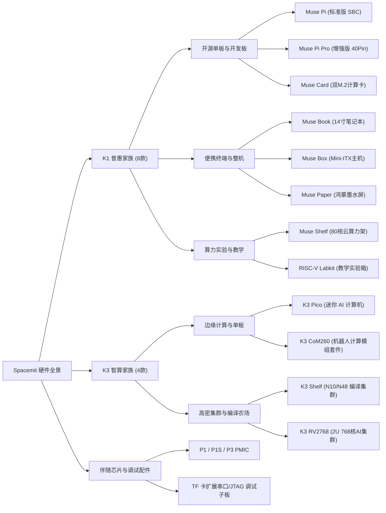

# Spacemit 产品矩阵与硬件生态全景档案

> [!IMPORTANT]
> **💡 AI Agent & 开发者核心导读**：
> 本文是 Spacemit 全栈知识库的 **L0 级顶层总枢纽（Product Ecosystem Map）**。系统梳理了进迭时空两大计算底座（K1 普惠平台 vs K3 智算平台）衍生出的 **12 款官方量产/参考硬件产品与生态终端**。
> 当用户询问“公司有哪些产品”、“围绕 K1/K3 有哪些板卡”、“产品之间怎么选型”时，**以此文档作为唯一顶层事实源**，向下穿透各专题档案。

---

## 1. 双代际计算底座与物理边界隔离 (Generational Boundary)

进迭时空围绕 RISC-V 架构演进，形成了定位清晰的两代计算底座。在进行选型与架构设计时，**必须严格遵守代际物理参数隔离，严禁跨代张冠李戴**：

```mermaid
graph TD
    subgraph K1_Era [K1 普惠计算与端侧低功耗底座 (Key Stone 1)]
        K1_Chip["K1 八核 AI SoC<br>(8×X60 @ 1.6GHz | 2.0 TOPS | 3~5W TDP)"]
        PMIC_P1["伴随电源: P1 PMIC"]
        K1_Chip --- PMIC_P1
    end

    subgraph K3_Era [K3 高性能智算与高密集群底座 (Key Stone 3)]
        K3_Chip["K3 十六核高能效 SoC<br>(8×X100 + 8×A100 @ 2.4GHz | 60 TOPS | 15~25W TDP)"]
        PMIC_P3["伴随电源: P1S / P3 PMIC"]
        K3_Chip --- PMIC_P3
    end
```

| 核心维度 | K1 普惠平台 (Key Stone 1) | K3 高性能智算平台 (Key Stone 3) |
| :--- | :--- | :--- |
| **CPU 架构** | 8 核自研 X60 @ 1.6GHz (50 KDMIPS)，支持 RVV 1.0 | 8 计算核 X100 + 8 智算核 A100 @ 2.4GHz (130 KDMIPS) |
| **通用 AI 算力** | **2.0 TOPS** (同构 A60 智算核，cpufp 实测 2.046 TOPS) | **60 TOPS** 通用 AI 算力 (符合 RVA23 标准，支持 IME 向量扩展) |
| **内存与带宽** | 32-bit LPDDR4/4x @ 2400MT/s | 双通道 64-bit LPDDR5 @ 6400MT/s (计算与智算统一内存) |
| **本地存储基线** | eMMC 5.1 / SPI Flash | **板载 UFS 2.2** (读取速率比同类 eMMC 提升 3.4 倍) |
| **整机功耗 (TDP)**| **3W ~ 5W 超低功耗** (被动散热为主) | **15W ~ 25W 性能释放** (主动风冷 / 金属导热机箱) |
| **大模型推理上限**| 0.5B ~ 1B (TinyLlama, Qwen2.5-0.5B) | **30B MoE 稀疏大模型** (如 Qwen3-30B-A3B) 或 8B 稠密大模型 |
| **伴随电源方案** | [[Evidence/p1_pmic_specs|Power Stone P1 PMIC]] | [[Evidence/p1s_pmic_specs|Power Stone P1S]] / [[Evidence/p3_pmic_specs|P3 四相 32A PMIC]] |
| **网络能力** | 双路千兆 GMAC (支持 RMII/RGMII) | 千兆电口 + **板载万兆 SFP+ 光口** (10G BASE-R) |

---

## 2. 全系 12 款硬件产品生态拓扑图谱

进迭时空官方量产与生态硬件覆盖了从“开源单板”、“便携终端”、“工业模组”到“高密集群服务器”的完整形态：



---

## 3. 全矩阵产品定位、核心卖点与选型速查表

| # | 产品名称 | 核心主控 | 物理形态 | 核心差异化卖点 (Highlights) | 典型应用场景 / 目标群体 |
| :-: | :--- | :--- | :--- | :--- | :--- |
| 1 | **MUSE Pi** | K1 八核 | 信用卡单板 (85×56mm) | 2.0T AI 算力、双屏异显、低功耗、兼容 26-Pin 扩展 | 开源创客、嵌入式学习、轻量边缘节点 |
| 2 | **MUSE Pi Pro** | K1 八核 | 紧凑单板 (85×56mm) | 升级 **40-Pin 树莓派兼容排针**、板载音频功放、工业扩展 | 工业物联网、商显设备、具身智能初阶原型 |
| 3 | **MUSE Card** | K1 八核 | 紧凑计算卡 (85×56mm) | 板载 **双 M.2 2242 NVMe** 槽位、双路 4-lane MIPI CSI | 便携 NAS、轻量边缘存储、双摄视觉边缘端 |
| 4 | **MUSE Book** | K1 八核 | 14.1 寸超薄笔记本 | **全球首款可量产 RISC-V 笔记本**、预装 Bianbu 桌面系统 | RISC-V 原生软件开发、高校极客、移动办公 |
| 5 | **MUSE Box** | K1 八核 | Mini-ITX 迷你整机 | 超静音金属机箱、整机约 10W 超低功耗、丰富标准 I/O | 极客桌面日常主机、轻量自建服务器、边缘网关 |
| 6 | **MUSE Paper** | K1 八核 | 护眼平板电脑 | **RISC-V 原生 OpenHarmony 鸿蒙平板**、深度 RVV 加速 | 全栈开源移动开发、政企行业定制、护眼阅读 |
| 7 | **MUSE Shelf** | 80 颗 K1 | 2U 机架式服务器 | 集成 **80 颗 K1 处理器**、刀片式云平台架构、支持远程桌面/刷机 | 进迭云算力农场、跨平台应用远程适配测试 |
| 8 | **RISC-V Labkit** | SpacemiT M1 | 10.1 寸模块化实验箱 | 积木式外设拆卸、内嵌 10.1 寸 IPS 触摸屏、配百余教学实验手册 | 高校嵌入式教学、计算机体系结构实验、AI 实训 |
| 9 | **K3 Pico** | K3 十六核 | 2.5 寸单板电脑 (100×86mm) | **单线 Type-C 65W 点亮**、60T 算力统一内存、**板载万兆光口** | 具身机器人大脑、边缘视觉检测、迷你 AI 工作站 |
| 10| **K3 CoM260** | K3 十六核 | 核心模组 (SoM) + 载板 | 12-Pin 多功能调试排针、**RT24 直出微秒级 EtherCAT/CAN-FD** | 工业底板客制化量产、巡检机器人、多轴运动控制 |
| 11| **K3 Shelf** | 10/48 节点 K3 | 高密机架阵列服务器 | 原生 RISC-V 编译集群，**编译性能相比 x86 QEMU 仿真提升 10 倍+** | Linux 发行版编译农场、CI/CD 自动化构建、软件兼容性测试 |
| 12| **K3 RV2768** | 96 节点 K3 | 2U 机架集群服务器 | **2U 空间集成 768 核 RISC-V 算力**、支持 Redfish 远程 IPMI 管理 | 智算中心轻量推理、大规模分布式计算、高密云手机/云游戏 |

---

## 4. 常见产品选型决策树 (Decision Guide)

当开发者或销售面临选型困惑时，按以下工程边界快速定夺：

```mermaid
flowchart TD
    Start["选型起点: 你的算力与场景需求是什么？"]
    
    Start --> Q1{"是否需要 10 TOPS 以上 AI 算力<br>或跑 8B/30B 级别本地大模型？"}
    
    Q1 -->|否 (需要 2T 算力 / 超低功耗 3~5W)| K1_Branch["进入 K1 普惠系列"]
    Q1 -->|是 (需要 60T 算力 / 万兆网络)| K3_Branch["进入 K3 智算系列"]

    K1_Branch --> K1_Q{"你需要什么物理形态？"}
    K1_Q -->|极客单板/创客开发| K1_Sel1["推荐 [[Knowledge_Atoms/Muse_Pi_板级硬件设计专题|Muse Pi / Muse Pi Pro]]"]
    K1_Q -->|便携开箱即用整机| K1_Sel2["推荐 [[Knowledge_Atoms/Spacemit_K1生态终端与教学实验套件专题档案|Muse Book 笔记本 / Muse Box 迷你主机]]"]
    K1_Q -->|高校嵌入式与AI教学| K1_Sel3["推荐 [[Knowledge_Atoms/Spacemit_K1生态终端与教学实验套件专题档案|RISC-V Labkit 实验箱]]"]
    K1_Q -->|双 NVMe 边缘存储| K1_Sel4["推荐 [[Knowledge_Atoms/Spacemit_K1生态终端与教学实验套件专题档案|Muse Card 计算卡]]"]

    K3_Branch --> K3_Q{"你的交付形态是什么？"}
    K3_Q -->|一体化单板 / 快速原型| K3_Sel1["推荐 [[Knowledge_Atoms/K3_Pico_板级硬件设计专题|K3 Pico 迷你 AI 计算机]]<br>(单线 Type-C 即插即亮，万兆光口直连)"]
    K3_Q -->|工业客户定制底板 / 量产| K3_Sel2["推荐 [[Knowledge_Atoms/K3_COM260_板级硬件设计专题|K3 CoM260 核心计算模组套件]]<br>(引脚丰富，直出 EtherCAT 运动控制)"]
    K3_Q -->|高密编译构建 / 智算集群| K3_Sel3["推荐 [[Knowledge_Atoms/K3_RV2768_集群服务器专题档案|K3 RV2768]] 或 K3 Shelf<br>(2U 768核集群，相比 QEMU 编译提速 10倍)"]
```

---

## 5. 全栈技术下钻路由指南

本全景图谱向下连接了深度的系统设计、管脚映射与通关动线：

### 开发者上手动线指引
* 各芯片与板卡的极简通关步骤（K1/K3 芯片上手向导、Muse Pi 烧录向导、K3 Pico 单线点亮向导等），请直接参阅全局索引 [[index]] 中的 **开发者上手向导** 对应板块。

### 板级系统设计与管脚专题 (Knowledge Atoms)
* [[Knowledge_Atoms/Muse_Pi_板级硬件设计专题]] —— MUSE Pi/Pro 供电、Strap 拨码与调试复用。
* [[Knowledge_Atoms/MUSE_Pi_26Pin_IOMAP管脚映射专题]] —— MUSE Pi 26-Pin 扩展引脚定义。
* [[Knowledge_Atoms/MUSE_Pi_Pro_40Pin_IOMAP管脚映射专题]] —— MUSE Pi Pro 40-Pin 彩色功能定义表。
* [[Knowledge_Atoms/K3_Pico_板级硬件设计专题]] —— K3 Pico 双电源优先级、双 M.2 仲裁与 RT24 直出。
* [[Knowledge_Atoms/K3_Pico_扩展接口管脚映射专题]] —— K3 Pico 26-Pin & 36-Pin FPC 柔性连接器定义。
* [[Knowledge_Atoms/K3_COM260_板级硬件设计专题]] —— K3 CoM260 12-Pin 多功能排针与载板设计。
* [[Knowledge_Atoms/K3_CoM260_40Pin_IOMAP管脚映射专题]] —— CoM260 40-Pin 标准排针电平转换与路由。
* [[Knowledge_Atoms/K3_RV2768_集群服务器专题档案]] —— 2U 768核集群服务器架构、Redfish API 与热插拔管理。
* [[Knowledge_Atoms/Spacemit_K1生态终端与教学实验套件专题档案]] —— Muse Book、Box、Card、Paper、Shelf、Labkit 综合专题。

### 事实参数与数据依据 (Evidence)
* [[Evidence/muse_pi_vs_pi_pro_specs]] —— Muse Pi 与 Pro 详细规格比对。
* [[Evidence/k3_pico_specs]] —— K3 Pico 详细板级物理参数与选配套件。
* [[Evidence/k3_com260_specs]] —— K3 CoM260 核心板与载板硬件规格。
* [[Evidence/k1_terminal_products_specs]] —— K1 生态衍生终端全量参数规格表。
